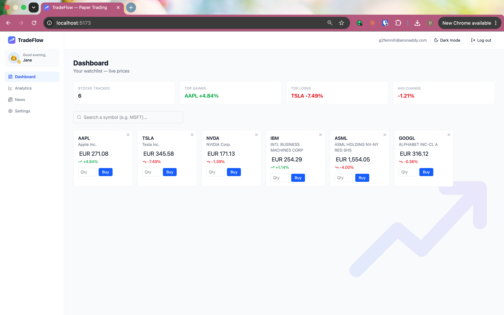

<div align="center">


# TradeFlow

**A real-time paper-trading web app — live market data, a simulated portfolio, and portfolio analytics.**

Built with React + TypeScript, Firebase, and TanStack Query.

_Reviewed by a senior engineer — 8.3/10 for code quality and architecture._

</div>

---

## Overview

TradeFlow is a full-stack trading simulator demonstrating production-grade patterns: real-time data synchronization, atomic multi-document writes, containerized deployment, and automated CI/CD — built to mirror how a real fintech dashboard would be engineered, minus the real money.

A user tracks a live stock watchlist, "buys" and "sells" with a simulated cash balance, and sees their portfolio's performance — all against **real market prices**. No real money is involved; it's a portfolio project that demonstrates real-time data handling, authenticated multi-user state, a polished responsive UI, and a full DevOps pipeline from container to cluster.

> **Note:** TradeFlow is desktop-optimized, with mobile responsiveness also supported.

## Screenshots

| Dashboard — live watchlist              | Analytics — portfolio & allocation      |
| --------------------------------------- | --------------------------------------- |
|  |  |

## Features

- **Live watchlist** — real-time quotes from Finnhub, with subtle price-flash animations on every update.
- **Search & manage** — add or remove any symbol; each user's watchlist is persisted per-account in Firestore.
- **Expandable sparklines** — click a card to reveal a live price chart that builds up over the session.
- **Paper trading** — start with a simulated balance, then buy/sell at live prices. Trades are written atomically and cost basis is tracked with a weighted average.
- **Portfolio analytics** — cash, holdings value, and total value (with count-up animations), a live profit/loss table, and an allocation donut with a value/percentage breakdown.
- **Price alerts** — set target prices on watched symbols and get notified when they're hit.
- **Company news** — latest headlines for the day's top movers.
- **Multi-currency** — view every figure in USD, EUR, GBP, or NGN using live exchange rates.
- **Accounts & profiles** — email/password auth with an editable profile (name, date of birth, address, avatar).
- **Dark / light mode** — persisted across sessions.
- **Responsive layout** — usable on mobile as well as desktop.
- **Thoughtful UX** — toast notifications, confirm dialogs for destructive actions (including logout), and shimmer loading skeletons.
- **Full multi-language support** — every page and component in English, Finnish, and Swedish, with a flag-based switcher and compile-time type-checked translation keys (a bad or missing key fails the build instead of surfacing at runtime).

## Tech stack

| Area                 | Technology                                |
| -------------------- | ----------------------------------------- |
| Framework            | React 19 + TypeScript (strict)            |
| Build tool           | Vite                                      |
| Server state         | TanStack Query (React Query) v5           |
| Styling              | Tailwind CSS v4                           |
| Charts               | Recharts                                  |
| Routing              | React Router v7                           |
| Auth & database      | Firebase Authentication + Cloud Firestore |
| Icons                | lucide-react                              |
| Market data          | Finnhub (quotes, search, company news)    |
| Exchange rates       | open.er-api.com                           |
| Internationalization | react-i18next (English, Finnish, Swedish) |
| Testing              | Vitest + React Testing Library            |
| Containerization     | Docker (multi-stage build, nginx)         |
| CI/CD                | GitHub Actions                            |
| Orchestration        | Kubernetes (`kind`)                       |
| Hosting              | Vercel                                    |

## Architecture

TradeFlow separates **server state** from **application state**:

- **Server state** (live quotes, news, FX rates) is fetched and cached with **TanStack Query** — automatic refetching, deduping, and stale handling.
- **Application state** (auth, profile, currency, watchlist, portfolio, theme, toasts, dialogs) is provided through composable **React context providers**.
- **Persistence** uses **Cloud Firestore** with real-time `onSnapshot` listeners, so the UI reacts the moment data changes. Buy/sell operations use a `writeBatch` so cash and holdings always update together.
- **Security rules** scope every document to its owner, so a signed-in user can only ever read and write their own portfolio, watchlist, and profile.

## DevOps & Deployment

- **Containerized** — multi-stage Docker build (~93MB final image), with nginx serving the production build.
- **CI/CD** — GitHub Actions pipeline runs lint and build on every push, securely injecting Firebase and Finnhub secrets.
- **Kubernetes** — deployed locally via `kind`, running a 2-replica Deployment behind a NodePort Service, accessible through `kubectl port-forward`.
- **Live deployment** — hosted on Vercel with SPA routing configured via `vercel.json`.

## Getting started

### Prerequisites

- Node.js 18+ and npm
- A Firebase project (Authentication + Firestore enabled)
- A free Finnhub API key

### Install & run

```bash
git clone https://github.com/rex-daworker/trading-app.git
cd trading-app
npm install
npm run dev
```

The app runs at `http://localhost:5173`.

### Environment variables

Create a `.env.local` file in the project root (this file is git-ignored and must never be committed):

```bash
VITE_FINNHUB_KEY=your_finnhub_key
VITE_FIREBASE_API_KEY=your_firebase_api_key
VITE_FIREBASE_AUTH_DOMAIN=your_project.firebaseapp.com
VITE_FIREBASE_PROJECT_ID=your_project_id
VITE_FIREBASE_APP_ID=your_firebase_app_id
```

### Firestore security rules

```
rules_version = '2';
service cloud.firestore {
  match /databases/{database}/documents {
    match /portfolios/{userId} {
      allow read, write: if request.auth != null && request.auth.uid == userId;
      match /holdings/{symbol} {
        allow read, write: if request.auth != null && request.auth.uid == userId;
      }
    }
    match /profiles/{userId} {
      allow read, write: if request.auth != null && request.auth.uid == userId;
    }
    match /watchlists/{userId} {
      allow read, write: if request.auth != null && request.auth.uid == userId;
    }
  }
}
```

### Running with Docker

```bash
docker build -t tradeflow .
docker run -p 8080:80 tradeflow
```

### Running on Kubernetes (local `kind` cluster)

```bash
kind create cluster --name tradeflow
kubectl apply -f k8s/
kubectl port-forward svc/tradeflow 8080:80
```

## Project structure

```
src/
├── api/          # Finnhub + FX fetchers and their response types
├── hooks/        # Data hooks (quotes, candles, news) + UI hooks (count-up, price-flash, debounce)
├── context/      # Auth, Profile, Currency, Watchlist, Portfolio, Alerts, Theme, Toast, Confirm
├── components/   # Layout, Sidebar, StockCard, charts, controls, watermark, skeletons
├── pages/        # Dashboard, Analytics, Alerts, History, News, Settings, Account, AuthPage
├── i18n/         # Translation resources (en/fi/sv) and type-safe t() setup
├── lib/          # Firebase initialization + pure portfolio math (cost basis, validation)
├── test/         # Vitest setup
└── types/        # Shared TypeScript types
```

## Disclaimer

TradeFlow is a **paper-trading simulator built for education and portfolio purposes**. It uses live market data but involves no real money, brokerage, or transactions. Prices are provided by third-party APIs and may be delayed. Nothing here is financial advice.

## Roadmap

The original build plan — persisted transaction history, real historical price charts, and automated tests — is complete. Under consideration for later:

- Commodity price data (oil, gold, silver) via a dedicated provider; Finnhub's quote endpoint only reliably covers US-listed equities, not commodities or non-US exchanges.
- Wiring the test suite into the existing CI pipeline (`.github/workflows/ci.yml` currently runs lint and build, not tests).

---

<div align="center">
Built by <a href="https://github.com/rex-daworker">rex-daworker</a>
</div>
