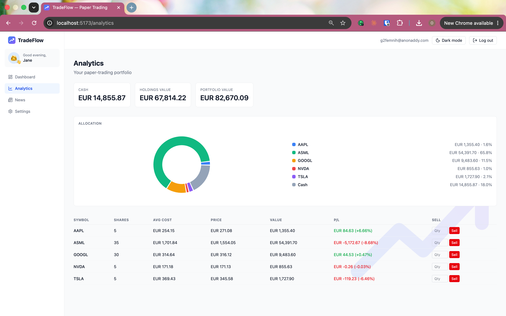

# TradeFlow

A real-time, multi-currency **paper-trading app** built with React, TypeScript and Firebase. Track live stock prices, manage a watchlist, and trade with virtual cash — with a per-user portfolio that persists in the cloud and shows live profit/loss.

> ⚠️ **Paper trading only.** TradeFlow uses virtual money for learning and demonstration. No real funds, brokerage accounts, or financial advice are involved.

<!-- Add screenshots here once you drop the image files into a /screenshots folder.
     Example:


-->

## Features

- **Live market data** — real-time quotes and symbol search via the [Finnhub](https://finnhub.io/) API, auto-refreshing every 15 seconds.
- **Watchlist** — add or remove stocks; your list persists across reloads.
- **Live price charts** — click any card to expand an accumulating sparkline chart (Recharts).
- **Overview widgets** — stocks tracked, top gainer, top loser, and average change, derived live from your watchlist.
- **Paper-trading portfolio** — start with $100,000 in virtual cash, buy and sell at live prices, and track holdings with weighted-average cost and live profit/loss.
- **Per-user cloud persistence** — each user's cash and holdings are stored in Firestore and protected by security rules so users can only access their own data.
- **Authentication** — email/password sign-up and login with Firebase Auth.
- **Multi-currency display** — view all prices and portfolio values in USD, EUR, GBP or NGN, converted with live exchange rates.
- **Dark / light mode** — system-aware theme toggle that remembers your choice.
- **Client-side routing** — Dashboard, Analytics and Settings pages with React Router.

## Tech stack

| Area | Technology |
|------|------------|
| Framework | React 19 + TypeScript (strict mode) |
| Build tool | Vite |
| Server state / data fetching | TanStack Query |
| Styling | Tailwind CSS |
| Charts | Recharts |
| Auth & database | Firebase (Authentication + Cloud Firestore) |
| Routing | React Router |
| Market data | Finnhub API |
| FX rates | open.er-api.com |

## Architecture

TradeFlow is structured around a few clear patterns:

- **React Context providers** for cross-cutting state — theme, currency, authentication, and the portfolio — each exposing a small typed hook (`useTheme`, `useCurrency`, `useAuth`, `usePortfolio`).
- **Custom hooks** wrap data fetching: `useQuote` / `useQuotes` (live prices via TanStack Query with a shared cache), `useSymbolSearch` and `useDebouncedValue` (debounced search).
- **Firestore realtime listeners** (`onSnapshot`) keep the portfolio in sync — a trade writes to the database, and the UI updates automatically with no manual refetch.
- **Atomic trades** — buying and selling update cash and holdings together using a Firestore `writeBatch`, so the two writes never get out of sync.
- **Secrets via environment variables** — all API keys and Firebase config are loaded from a gitignored `.env.local`, never committed.

## Getting started

### Prerequisites

- Node.js 18+ and npm
- A [Finnhub](https://finnhub.io/) API key (free tier)
- A [Firebase](https://console.firebase.google.com/) project with **Email/Password Auth** and **Cloud Firestore** enabled

### Setup

```bash
# 1. Clone and install
git clone https://github.com/rex-daworker/trading-app.git
cd trading-app
npm install

# 2. Add your secrets (see below), then run
npm run dev
```

Create a `.env.local` file in the project root:

```bash
VITE_FINNHUB_KEY=your_finnhub_api_key
VITE_FIREBASE_API_KEY=your_firebase_api_key
VITE_FIREBASE_AUTH_DOMAIN=your-project.firebaseapp.com
VITE_FIREBASE_PROJECT_ID=your-project-id
VITE_FIREBASE_APP_ID=your_firebase_app_id
```

The app runs at `http://localhost:5173`.

### Firestore security rules

Publish these rules in the Firebase console so each user can only read and write their own portfolio:

```
rules_version = '2';
service cloud.firestore {
  match /databases/{database}/documents {
    match /portfolios/{userId} {
      allow read, write: if request.auth != null && request.auth.uid == userId;

      match /holdings/{symbol} {
        allow read, write: if request.auth != null && request.auth.uid == userId;
      }
    }
  }
}
```

## Project structure

```
src/
├── api/            # External data sources (Finnhub quotes/search, FX rates)
├── components/     # UI components (cards, search, charts, buy/sell controls, layout)
├── context/        # Theme, Currency, Auth, Portfolio providers
├── hooks/          # useQuote, useQuotes, useSymbolSearch, useDebouncedValue
├── lib/            # Firebase initialisation (auth + firestore)
├── pages/          # Dashboard, Analytics, Settings, AuthPage
├── types/          # Shared TypeScript types
└── main.tsx        # App entry + provider composition
```

## Roadmap

Planned polish and additions:

- [ ] lucide-react icons across navigation and cards
- [ ] Tasteful micro-animations (price flash on update, count-up numbers)
- [ ] Company news for top movers
- [ ] Price alerts with browser notifications

## License

Personal portfolio / learning project.
